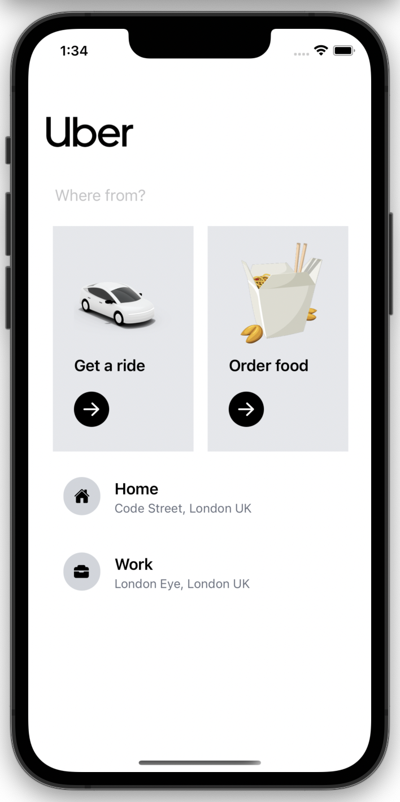
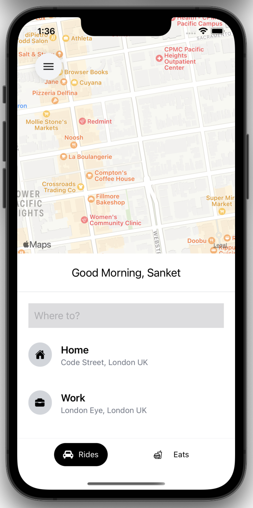
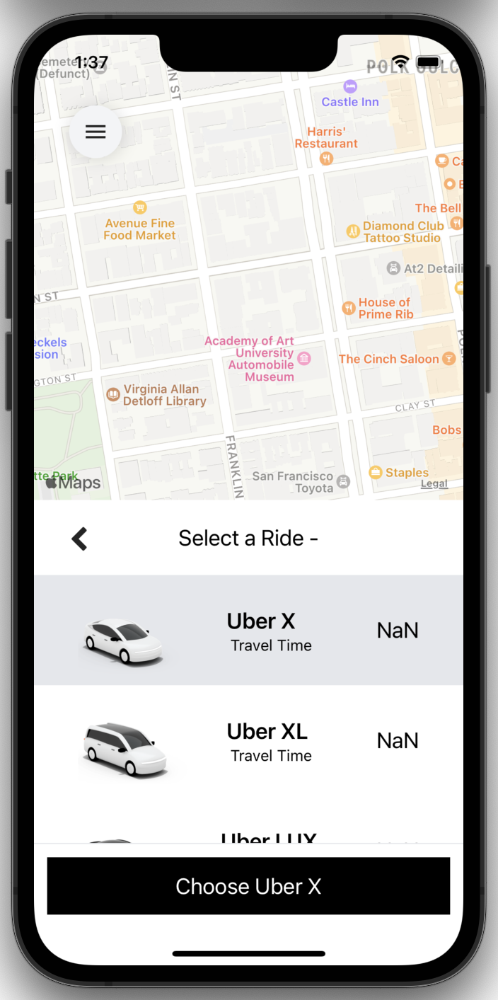

[](https://github.com/signuldotdev/Uber-Clone/blob/main/README.md)

## Smoothly Animated Uber Clone build using React Native + Tailwindcss

<div>

<div>

<br/>

## 🧑🏻‍💻 Story

### Uber Clone is an app that allows users to search a place and create a ride request and get the estimated fare and provide best way to get to the destination. Uber Clone uses the Google Maps API for Showing Maps on MapScreen and Google Places Autocomplete for location based search. This UI build using tailwindcss and react native components.

## 📱 Snapshot

<p>
    
    
    
</p>

<br/>

<div align='left'>

## 🍜 Ingredients

- [Expo](https://expo.dev/)
- [React Native](https://reactnative.dev/)
- [React Navigation](https://reactnavigation.org/)
- [React Native Google Places Autocomplete](https://github.com/FaridSafi/react-native-google-places-autocomplete#readme)
- [Google Cloud Platform](https://console.developers.google.com)
- [Tailwind CSS](https://tailwindcss.com/)
- [Redux](https://redux.js.org/)

<div>

## 💻 How to Dev

This project can be run from the Expo client app.

```jsx
yarn
yarn start
```
